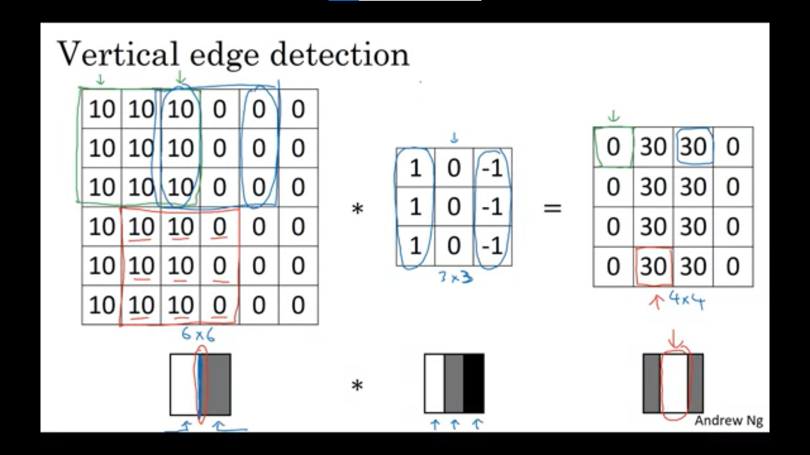
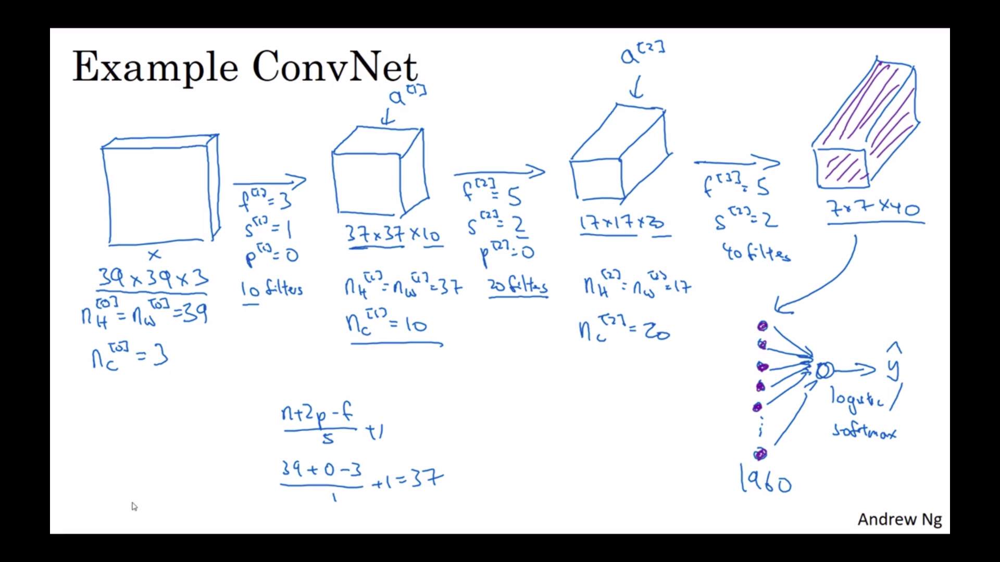
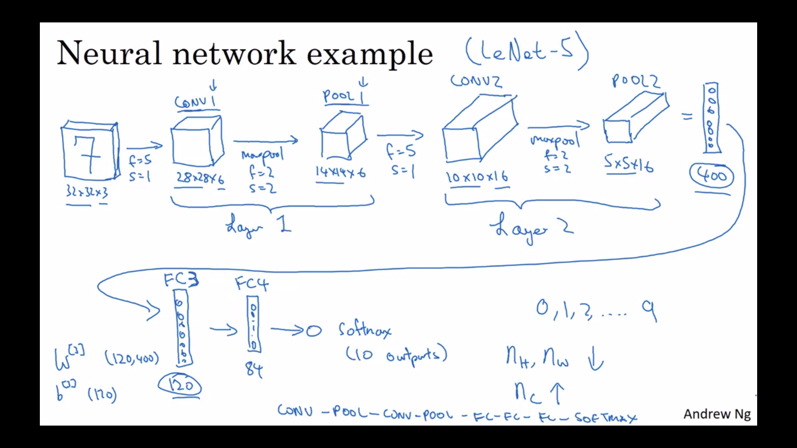
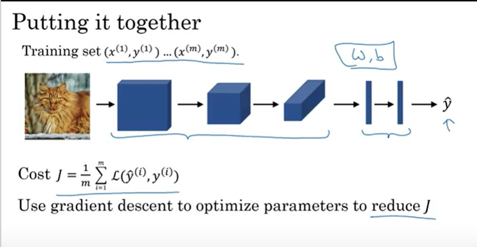

# Convolutional Neural Networks [Coursera] https://www.coursera.org/learn/convolutional-neural-networks/home/welcome Week 1
---
### Computer Vision
Deep learning in Computer Vision has many applications such as facial recognition, image classification/recognition, object detection (very helpful for self driving cars), neural style transfer, etc. One problem that we encounter in computer vision is that high resolution images often lead us to have billion-dimensional matrices. In order to do this, we need to learn implementations of convolutional operations.

---
### Edge Detection
Example : Vertical Edge Detection
A standard way of applying convolution to say detect vertical edges in a matrix is to multiply it with filter or kernel with specific values for the required output. The asterisk '*' denotes convolution or multiplication or element wise multiplication. Thus, to multiply the 3x3 'kernel' matrix, paste it on the first 3x3 block of the image matrix, and the sum of the element wise product of those 9 blocks give us the 1st element's value is our output matrix. To get the second element in the first row of the output, we shift the pasting of the 3x3 kernel 1 column to the right as shown.

A common kernel for vertical edge detection is 

$$\begin{bmatrix} 1 & 0 & -1 \\\ 1 & 0 & -1 \\\ 1 & 0 & -1\end{bmatrix}$$
An intuitive way to think about this kernel's values is that wherever there are similar values of pixels in a region of the image (all bright or all dark), the symmetry of the kernel will cancel them and output a zero, whereas if there are light (higher value) pixels of the left and dark (lower value) pixels on the right, or vice versa, with a prominent edge between them, the kernel gives a high or extrememly low value in the region of the edge, highlighting it. 

---
### Using Edge Detection in Convolution 
Thus, a light to dark pixel transition for an edge would give you the edge brightened whereas a dark-to-light transition would give the edge darkened. IF we do not want to differenciate, we can atke absolte values of the outpiut matrix.

Similarly, some other kernels and their common uses are 
---
**Horizontal edge detetction**
 $$\begin{bmatrix} 1 & 1 & 1 \\\ 0 & 0 & 0 \\\ -1 & -1 & -1\end{bmatrix}$$ 

 **Sobel Filter** It has the advantage of bring a bit more robust due to the added weight on the central row.
  $$\begin{bmatrix} 1 & 0 & -1 \\\ 2 & 0 & -2 \\\ 1 & 0 & -1\end{bmatrix}$$     

   **Schuann Filter** Has slightly different properties, used for horizontal edge detection, and if we flip it 90 degrees, we get vertical edge detection.
  $$\begin{bmatrix} 3 & 0 & -3 \\\ 10 & 0 & -10 \\\ 3 & 0 & -3\end{bmatrix}$$

  Sometimes, these 9 numbers don't even need to be handpicked, and can just be assumed as parameters which can be learnt via macine learning through back propogation.

  ---
  ### Padding

Padding is necessary for 1)keeping the original dimensions of the image and 2)ensuring an even contribution of all edge and corner pixels in the output image.

Our parameters are conventionally p=1 (i.e the image is padded on all sides with a border of 1), and padding_value=0 (i.e the value of the pixels in the padded region is conventionally kept 0).

**Valid Convolutions** have no padding and take a nxn image convoluted with an fxf filter to give an output image of (n-f+1)x(n-f+1) dimensions.
**Same Convolutions** are the more common choice and are padded such that the dimensions of the output image is same as that of the imput image. 
Thus, after deriving, we get the avlue of the padding parameter to be
$$ p = \frac{f-1}{2} $$ 
##### where the filter has dimensions fxf.

We also note thats by convention, f is usually odd.

---
### Strided Convolutions
Sometimes, if we hop to the right by two columns instead of one, i.e by a stride of 2, we get **strided convolutions**. This shrinks the size of our output image. So, if we convolve as shown, our output image's dimensions come out to be

$$ [nxn]image * [fxf]filter =  [(\frac{n+2p-f}{s} +1) x (\frac{n+2p-f}{s} + 1)] outputimage  $$
##### with a padding = p and stride = s

#### Note : 

#### Difference between cross-correlation vs. convolution 
Technically, this operation that we have been using is maybe better called cross-correlation but most of the deep learning literature just calls it the convolution operator

---

### Convolutions over Volume
Doing convolutions over a mxnx3 matrix, where the 3 correcponds to the number of channels i.e. RGB colour channels. For this, we often use a 3x3x3 matrix filter, or a cube. Thus, this cube's 3 channels move over the 3 channels in the input image and we convolve as usual.
#### Use: If we change the values of parameters in the individual channels of the 3x3x3 filter, we can detect edges or perform similar operations on a specific colour.
Also, it should be noted that convolving over volumes, even with the input image and kernel being 3-dimensional, we get a 2-dimensional normal output image.
If we use 2 different filters,say to detect vertical AND horizontal edges, we end up with two 1-dimensional outputs that can arranged to be a single output having a 3-rd dimension being equal to the number of filters. Thus,

$$ [nxnxn_c]image * [fxfxn_c]filter =  [(n-f+1) x (n-f+ 1) x n_f]outputimage  $$
##### where n_c = no. of channels in the image; n_f = no. of filters applied/features to be detected in the image

### One Layer of a convolutional Nueral Networks

 

---

### Pooling Layers
A pooling layer does not have its own weights and is grouped together with the layer of the previous convolutional layer.

---

### CNN Example

So as you go deeper usually the height and width, nh and nw ,will decrease, whereas the number of channels will increase.

 Another pretty common pattern you see in neural networks is to have conv layers, maybe one or more conv layers followed by a pooling layer, and then one or more conv layers followed by pooling layer.

 ---

 ### Why Convolutions

 

 finally, for our model,

  