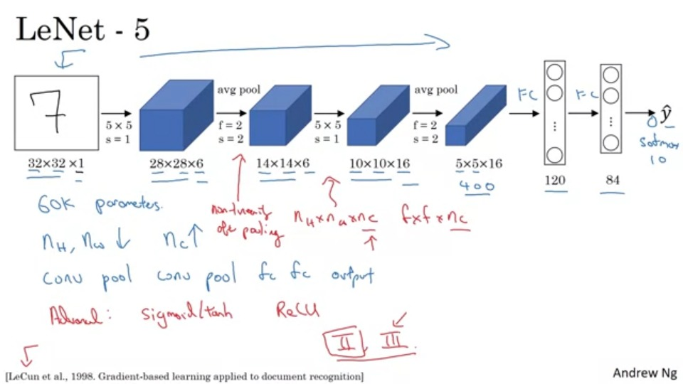
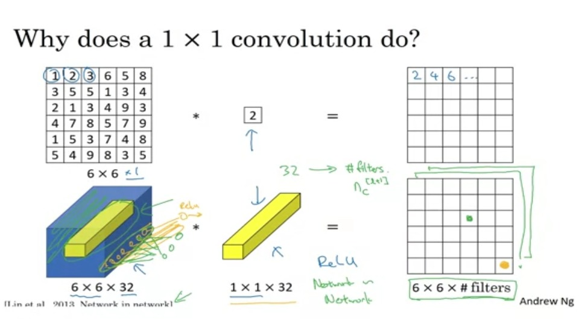

## Classic Networks

### LeNet-5 


The goal for this model was to identify handwritten digits in a `32x32x1` gray image.
A common pattern we see is that
`Conv ==> Pool ==> Conv ==> Pool ==> FC ==> FC ==> output`
  type of arrangement is quite common. Also, as we noted previously, as we go deeper into a network, the dimensions decreasewhile no of channels increase.

A few other things that were different in this paper were:

* Back then, sigmoid and tanh non-linearities were used way more than RELU non-linearities. 
* a complexity that we wouldn't see in modern implementations would be how different filters would look at different channels of the input block to save on computation time and parameters.
* Another non-conventional thing done in the paper is the use of a non-linearity layer right after a pooling layer.
* The paper also talks about graph transformer network.
  

  ---

  ### AlexNet

  

  * This model follows a pattern as 

    ```
      Conv => Max-pool => Conv => Max-pool => Conv => Conv => Conv => Max-pool ==> Flatten ==> FC ==> FC ==> Softmax
      ```

   * It uses a lot of same convolutions instead of valid convolutions.   
   * This is similar to LeNet, but much bigger and has many more parameters which helped in accuracy of training.
   * This network is large even by modern standards. It has around 138 million parameters. Most of the parameters are in the fully connected layers. 
[[Simonyan & Zisserman 2015. Very deep convolutional networks for large-scale image recognition]](https://arxiv.org/abs/1409.1556)

---

## Advanced networks
Skip connection which makes you take the activation from one layer and suddenly feed it to another layer even much deeper in NN allows you to train large NNs even with layers greater than 100.

  **Residual block**
  - ResNets are built out of some Residual blocks.
  - 
  - They add a shortcut/skip connection before the second activation.
  - Thus, when we skip from the lth to [l+2]th layer, we skip a linear, ReLU and Linear layer to get the final activation as 
  - ```
      a[l+2] = g( z[l+2] + a[l] )
      	     = g( W[l+2] a[l+1] + b[l+2] + a[l] )
      ```
**Residual Network**
  - Are a NN that consists of some Residual blocks.
  
  
  - These networks can go deeper without hurting the performance.

  
  - On the left is the normal NN and on the right are the ResNet. As you can see the performance of ResNet increases as the network goes deeper.
  - 
### Why ResNets work


---


  - Lets add two layers to this network as a residual block:

    - `X --> Big NN --> a[l] --> Layer1 --> Layer2 --> a[l+2]`
    - And a`[l]` has a direct connection to `a[l+2]`
  - This show that identity function is easy for a residual block to learn. And that why it can train deeper NNs.

  - Also that the two layers we added doesn't hurt the performance of big NN we made.
 ##### Hint: dimensions of z[l+2] and a[l] have to be the same in resNets. In case they have different dimensions what we put a matrix parameters (Which can be learned or fixed)

- Using a skip-connection helps the gradient to backpropagate and thus helps you to train deeper networks

- Residual blocks types:

  - Identity block:
    - 
    - Hint the conv is followed by a batch norm `BN` before `RELU`. Dimensions here are same.
    - This skip is over 2 layers. The skip connection can jump n connections where n>2
    - This drawing represents [Keras](https://keras.io/) layers.
  - The convolutional block:
    - 
    - The conv can be bottleneck 1 x 1 convulution.


---

### Network in Network and 1 X 1 convolutions


- A 1 x 1 convolution  - We also call it Network in Network- is so useful in many CNN models when:
-   - We want to shrink the number of channels. We also call this feature transformation.
      - We will later see that by shrinking it we can save a lot of computations.
      - If we have specified the number of 1 x 1 Conv filters to be the same as the input number of channels then the output will contain the same number of channels. Then the 1 x 1 Conv will act like a non linearity and will learn non linearity operator. 
